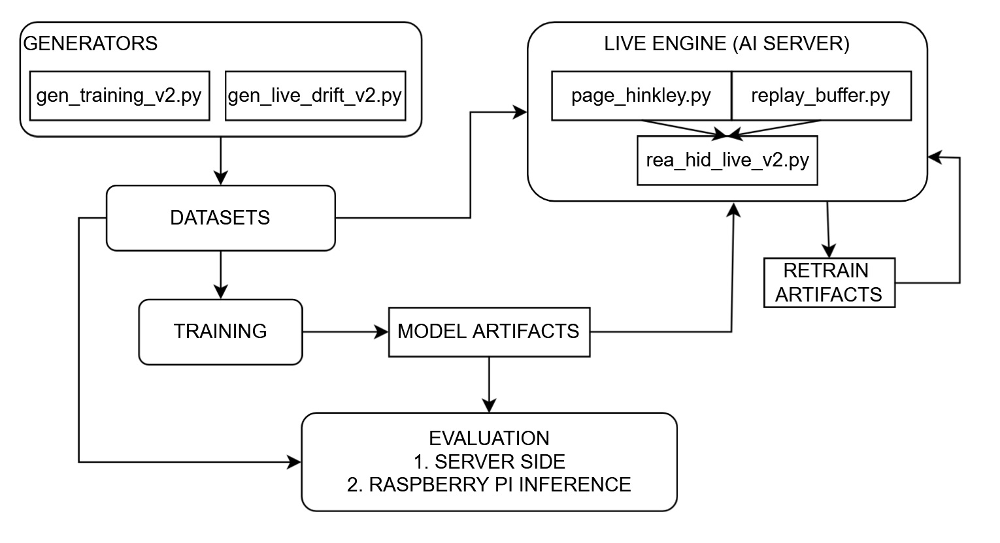

# Kashmeera_REA-HID-IoT-Deployment
Hybrid Intrusion Detection and Drift Adaptation for IoT Gateways (Raspberry Pi Deployment)
A practical deployment on AI Server and Raspberry Pi 5.
### 1. Project Overview
REA-HID is a **hybrid intrusion detection system (IDS)** for IoT networks.

It combines:
* a **supervised MLP classifier**,
* an **unsupervised AutoEncoder**, and
* an **online adaptive retraining mechanism** using Page–Hinkley drift detection + Replay Buffer.

The IDS detects:
* normal attacks
* **low-and-slow timing attacks**
* unseen traffic distributions (via adaptation)

REA-HID was fully deployed and validated on:

* **High-performance AI Server** (training + drift engine)
* **Raspberry Pi 5** (TFLite inference)

This repository contains the **entire reproducible pipeline**:
generation → training → deployment → drift adaptation → evaluation.

## **2. Why This Project Is Useful**

* Demonstrates a **state-of-the-art adaptive IDS** for IoT
* Detects both high-rate and low-rate attacks
* Learns and adapts to network drift **in real time**
* Lightweight model suitable for **edge devices (RPi5)**
* Ensures parity between AI server and Pi inference
* Completely reproducible and easy to extend

## **3. Repository Structure**

```
REA-HID-IoT-Deployment/
│
├── data/                         # Labeled test & drift datasets (CSV)
│   ├── demo_short.csv
│   ├── live_drift_v2_13feat.csv
│   └── live_drift_strong.csv
│
├── generators/                   # Synthetic data & drift generators
│   ├── gen_training_v2.py
│   └── gen_live_drift_v2.py
│
├── training/                     # Hybrid model (MLP + AE) training
│   └── train_rea_hid_v2.py
│
├── models/                       # Final exported model artifacts
│   ├── rea_hid_final.keras
│   ├── rea_hid_final_float16.tflite
│   ├── rea_hid_scaler.pkl
│   └── rea_hid_threshold.npy
│
├── live_engine/                  # Full drift-adaptive runtime (AI Server)
│   └── rea_hid_live_v2.py
│
├── evaluation/                   # Offline evaluation + Raspberry Pi inference
│   ├── rea_hid_eval_server.py
│   └── rea_hid_live_pi.py
│
|── utils/                        # Core logic for drift detection & retraining
|
|   ├── page_hinkley.py
    └── replay_buffer.py
|
├── code_arch.jpg                #architecture diagram
│

```


## **4. Installation**

### **AI Server Environment**

Install dependencies:

```bash
pip install numpy pandas joblib scikit-learn tensorflow matplotlib psutil
```

(Or use your own environment.yml file.)

### **Raspberry Pi 5**

```bash
sudo apt install python3-pip
pip3 install numpy pandas joblib psutil
pip3 install tflite-runtime
```

## **5. Quick Start (Reviewers can run in <30 seconds)**

### **A) Offline Evaluation (AI Server)**

Run this to verify the IDS model and metrics:

```bash
python3 evaluation/rea_hid_eval_server.py --csv data/demo_short.csv
```

This prints:

* Accuracy
* Precision
* Recall
* F1-score
* Confusion matrix

---

### **B) Raspberry Pi Inference**

After copying the `models/` folder and `demo_short.csv`:

```bash
python3 evaluation/rea_hid_live_pi.py --csv demo_short.csv --tflite models/rea_hid_final_float16.tflite
```

Outputs include:

* Per-flow MLP + AE hybrid decision
* Reconstruction errors
* F1 score matching server inference

---

### **C) Full Live Drift Engine (AI Server Only)**

Runs streaming inference + drift detection + adaptive retraining:

```bash
python3 live_engine/rea_hid_live_v2.py --strong_drift --prefer_tflite
```

Outputs:

* Page–Hinkley drift alerts
* Replay Buffer pseudo-label summary
* Retraining triggers + hybrid model exports
* Adaptation summary

Retrained models appear under:

```
retrain_artifacts/
```

---

## **6. Detailed Usage**

### **Generate Synthetic Training Dataset**

```
python3 generators/gen_training_v2.py
```

### **Generate Live Drift Dataset**

```
python3 generators/gen_live_drift_v2.py
```

### **Train Hybrid MLP + AutoEncoder Model**

```
python3 training/train_rea_hid_v2.py
```

### **Run Offline Evaluation on Any CSV**

```
python3 evaluation/rea_hid_eval_server.py --csv data/demo_short.csv
```

### **Run Raspberry Pi Inference**

```
python3 evaluation/rea_hid_live_pi.py --csv demo_short.csv
```

---

## **7. Architecture Diagram**




## **10. Credits**

Developed by: **Kashmeera R**
Program: M.Tech Cybersecurity Systems & Networks
Institution: Amrita School of Computing

Guide: Hari N N

